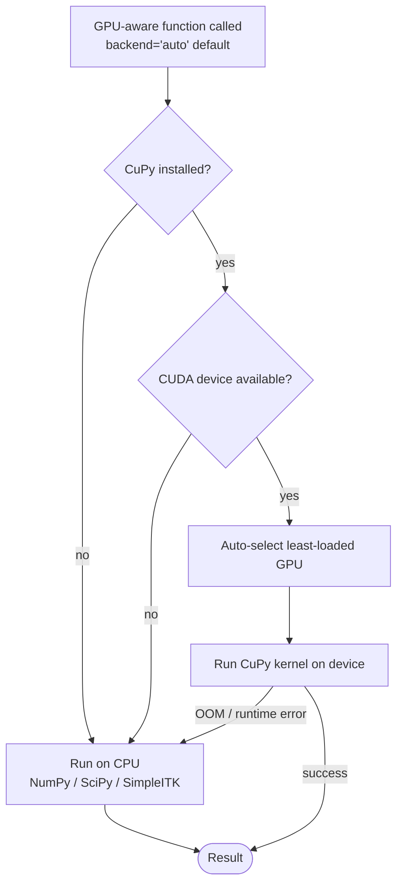

# GPU Acceleration


## Overview

linumpy supports GPU acceleration for compute-intensive operations using NVIDIA CUDA via CuPy. GPU acceleration is **optional** - all functions automatically fall back to CPU (NumPy/SciPy) if:

- CuPy is not installed
- No CUDA-capable GPU is available
- GPU memory is insufficient



backend selection is per-call (`backend="cpu" | "gpu" | "auto"`); the auto path is the safe default and is what the Nextflow workflows use when `use_gpu=true`.

---

## Quick Start

```bash
# Check your CUDA version
nvidia-smi | grep "CUDA Version"

# Install linumpy with GPU support (choose your CUDA version)
uv pip install 'linumpy[gpu]'           # CUDA 12.x (default)
uv pip install 'linumpy[gpu-cuda13]'    # CUDA 13.x

# Verify GPU
linum_gpu_info.py
linum_diagnose_pipeline.py --benchmark
```

---

## Installation

### Requirements

- NVIDIA GPU with CUDA Compute Capability 3.0+
- CUDA Toolkit 11.x, 12.x, or 13.x
- CuPy matching your CUDA version

**Recommended GPU:** NVIDIA A6000 (48GB) or similar professional GPU.

### CuPy Version Reference

| CUDA Version | CuPy Package | linumpy extra |
|--------------|--------------|---------------|
| CUDA 12.x    | `cupy-cuda12x` | `linumpy[gpu]` |
| CUDA 13.x    | `cupy-cuda13x` | `linumpy[gpu-cuda13]` |

---

## BaSiCPy (fix_illumination)

The `fix_illumination` step uses BaSiCPy 2.x, which now ships with a
**PyTorch backend** (no JAX). BaSiCPy will use a CUDA-enabled PyTorch wheel
automatically when one is installed; otherwise it runs on CPU.

If you only need linumpy's CuPy paths (resampling, FFT, morphology, N4),
no extra steps beyond `pip install 'linumpy[gpu]'` are required. To enable
GPU acceleration of BaSiCPy as well, install a CUDA build of PyTorch:

```bash
# Pick the index URL that matches your CUDA toolkit
uv pip install torch --index-url https://download.pytorch.org/whl/cu121
```

Verify:

```bash
linum_gpu_info.py
linum_diagnose_pipeline.py --benchmark
```

---

## GPU-Accelerated Scripts

All scripts now accept `--use_gpu` / `--no-use_gpu` (default: `--use_gpu`).
GPU acceleration is enabled automatically when a CUDA device is detected; no
separate `_gpu.py` variant is needed.

| Script | GPU-accelerated operation | Typical Speedup |
|--------|--------------------------|-----------------|
| `linum_estimate_transform.py` | FFT / phase correlation | 8-47x |
| `linum_create_mosaic_grid_3d.py` | Volume resize | 5-12x |
| `linum_resample_mosaic_grid.py` | Volume resize | 5-12x |
| `linum_normalize_intensities_per_slice.py` | Gaussian filter, Otsu threshold | 4-10x |
| `linum_fix_illumination_3d.py` | BaSiCPy via PyTorch/CUDA | 2-5x |
| `linum_assess_slice_quality.py` | SSIM, morphology | 3-8x |
| `linum_aip_png.py` | Mean projection | ≤1x |
| `linum_generate_mosaic_aips.py` | Mean projection | ≤1x |
| `linum_correct_bias_field.py` | N4 bias field estimation | varies |
| `linum_estimate_global_transform.py` | Phase correlation | 8-16x |

---

## GPU-Accelerated Operations

### Major Improvements (7-70x speedup)

| Operation | Function | Typical Speedup |
|-----------|----------|-----------------|
| Binary Morphology | `binary_closing()`, etc. | 7-67x |
| FFT/iFFT | `fft2()`, `ifft2()` | 9-47x |
| Gaussian Filter | `gaussian_filter()` | 7-20x |
| Phase Correlation | `phase_correlation()` | 8-16x |
| Resampling | `resize()` | 5-12x |

### Medium Improvements (4-10x speedup)

| Operation | Typical Speedup |
|-----------|-----------------|
| Normalization | 4-10x |
| Percentile Clipping | 4-10x |
| Interpolation | 5-10x |
| Mask Creation | 2-4x |

### No GPU Benefit (use CPU)

| Operation | Reason |
|-----------|--------|
| Mean/Max Projection | Simple reduction, transfer overhead dominates |
| Galvo Detection | Simple computation |

---

## Multi-GPU Systems

```bash
# Show status of all GPUs
linum_gpu_info.py --status

# Select best GPU (most free memory)
linum_gpu_info.py --select-best

# Use specific GPU via environment
CUDA_VISIBLE_DEVICES=1 nextflow run pipeline.nf --use_gpu true
```

---

## Memory Management

The NVIDIA A6000's 48GB VRAM typically holds entire mosaic grids. For larger volumes:

```python
import cupy as cp

# Clear GPU memory cache
cp.get_default_memory_pool().free_all_blocks()

# Check memory usage
mempool = cp.get_default_memory_pool()
print(f"GPU memory used: {mempool.used_bytes() / 1e9:.2f} GB")
```

---

## Troubleshooting

### GPU Not Detected

```bash
nvidia-smi
python -c "import cupy; print(cupy.cuda.runtime.getDeviceCount())"
linum_gpu_info.py
```

### BaSiCPy / PyTorch CUDA Issues

If `linum_fix_illumination_3d.py` falls back to CPU unexpectedly, verify the
PyTorch CUDA build is installed and visible:

```bash
python -c "import torch; print(torch.cuda.is_available(), torch.cuda.get_device_name(0))"
linum_diagnose_pipeline.py --debug-cuda
```

Reinstall PyTorch from the matching CUDA index URL (see the BaSiCPy section
above) if `torch.cuda.is_available()` returns `False`.

### Out of Memory

- Reduce batch size / chunk size
- Use `cp.get_default_memory_pool().free_all_blocks()` between operations
- Set `use_gpu=False` for specific operations

---

## Reference Benchmarks

Actual benchmarks on NVIDIA RTX A6000 (48GB):

| Operation | Image Size | CPU Time | GPU Time | Speedup |
|-----------|------------|----------|----------|---------|
| FFT2 | 2048×2048 | 207ms | 4.4ms | 47x |
| Phase Correlation | 2048×2048 | 3876ms | 240ms | 16x |
| Gaussian Filter | 2048×2048 | 79ms | 4.1ms | 20x |
| Binary Closing | 2048×2048 | 99ms | 1.5ms | 67x |
| Resize | 2048→1024 | 29ms | 3.4ms | 9x |
| Mean Projection | 100×2048×2048 | 71ms | 146ms | **0.5x** |

---

## Module Reference

```python
from linumpy.gpu import (
    GPU_AVAILABLE,      # bool: Is GPU available?
    CUPY_AVAILABLE,     # bool: Is CuPy installed?
    GPU_DEVICE_NAME,    # str: GPU name
    GPU_MEMORY_GB,      # float: GPU memory in GB
    to_gpu, to_cpu,     # Transfer functions
    print_gpu_info,     # Print info
)

# Submodules
from linumpy.gpu.fft_ops import fft2, ifft2, phase_correlation
from linumpy.gpu.interpolation import resize, affine_transform
from linumpy.gpu.morphology import binary_closing, gaussian_filter
from linumpy.gpu.array_ops import normalize_percentile, clip_percentile
```
