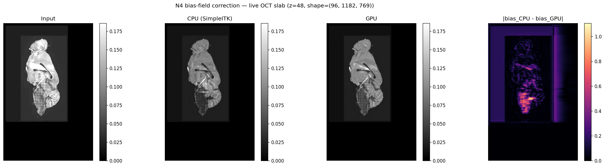

# N4 Bias-Field Correction — GPU Backend

This document describes the CuPy-accelerated N4 bias-field correction backend
used in `linumpy.intensity.bias_field.n4_correct(..., backend="gpu")`, the
algorithm it implements, where it diverges from `SimpleITK`'s reference
implementation, and the equivalency / performance envelope measured against
the SimpleITK CPU path on synthetic phantoms and live OCT volumes.

The corresponding CPU path wraps
`SimpleITK.N4BiasFieldCorrectionImageFilter` and is treated as the reference
throughout this document.

## 1. Reference

The implementation follows the standard N4 formulation:

- **N4ITK** (sharpening + multi-scale B-spline fit on a log-domain bias):
  Tustison NJ, Avants BB, Cook PA, Zheng Y, Egan A, Yushkevich PA, Gee JC.
  *N4ITK: improved N3 bias correction.* IEEE TMI 29(6):1310–1320, 2010.
  [doi:10.1109/TMI.2010.2046908](https://doi.org/10.1109/TMI.2010.2046908)
- **N3 sharpening foundation** (the histogram deconvolution kernel that N4 reuses):
  Sled JG, Zijdenbos AP, Evans AC. *A nonparametric method for automatic
  correction of intensity nonuniformity in MRI data.* IEEE TMI 17(1):87–97,
  1998. [doi:10.1109/42.668698](https://doi.org/10.1109/42.668698)

## 2. Mathematical model

N4 assumes a multiplicative, low-frequency bias field $b$ corrupting the true
signal $u$:

$$ s(x) = u(x) \cdot b(x), \qquad b(x) > 0, $$

so taking the log gives an additive decomposition:

$$ \log s(x) = \log u(x) + \log b(x) + n(x). $$

The algorithm alternates two steps until convergence at each resolution level:

1. **Histogram sharpening (N3 / Wiener deconvolution).** Build a histogram
   $S(f)$ of $\log s$ inside the foreground mask. Assume the true tissue
   distribution $U$ relates to $S$ by convolution with a centred Gaussian
   $F$. Estimate $U$ by Wiener deconvolution in the frequency domain:

   $$ \hat U(\xi) = \frac{\overline{\hat F(\xi)}}{|\hat F(\xi)|^2 + Z}\,\hat S(\xi), $$

   where $Z$ is a Wiener regularisation term proportional to the noise floor.
   The expected log-bias at every voxel is then

   $$ E[\log b\,|\,\log s] = \log s - \int f\,p(u=\log s - f)\,df, $$

   computed by table-lookup in the resharpened histogram.

2. **Smooth B-spline fit of the residual log-bias.** Fit a tensor-product
   cubic ($k=3$) B-spline to the per-voxel residuals, masked and intensity-
   weighted. The control-point lattice doubles at every pyramid level so
   that early levels capture the global trend and later levels add fine
   detail.

A multi-resolution pyramid (`shrink_factor`, `n_iterations` per level)
improves robustness and convergence.

## 3. Implementation

The CPU reference (`backend="cpu"`) calls
`SimpleITK.N4BiasFieldCorrectionImageFilter` directly, with
`n_control_points` derived per axis from the requested
`spline_distance_mm` and the volume extent:

```python
n_control_points = max(spline_order + 1,
                        round(extent_mm / spline_distance_mm))
```

The GPU path (`backend="gpu"`, in `linumpy.gpu.n4`) re-implements N4 on top
of `cupy` / `cupyx.scipy.signal`, with the following differences from
SimpleITK:

- **Pseudo-squared-distance B-spline (PSDB) scattered-data fit**
  (separable along each axis) following Lee, Wolberg & Shin
  (*IEEE TVCG 1997*), iterated on the residual log-bias as N4 does. PSDB
  preserves tissue contrast on regions with strong intensity variation
  where a plain weighted-mean kernel regression would absorb signal into
  the bias estimate. The fit is computed as three sequential 1-D
  `tensordot` contractions; per-axis B-spline basis matrices are cached
  per pyramid level (see {py:mod}`linumpy.gpu.bspline`).
- **Centred-Gaussian Wiener deconvolution** for histogram sharpening
  instead of the Vidal-Pantaleoni asymmetric kernel SimpleITK ships. The
  weighted bin update uses a single `cupy.bincount` call over the full
  volume (see {py:mod}`linumpy.gpu.n4`).
- **Separable Catmull-Rom upsample** for re-projecting the B-spline lattice
  back to image space, rather than `cupyx.scipy.ndimage.zoom`.
- **Single host→device transfer** per call: the volume and mask are pushed
  to GPU once, and all intermediate iterates stay on-device.
- **Auto-selection** of the least-loaded GPU when `backend="auto"` is
  requested and a GPU is available, with a transparent fallback to the
  CPU path otherwise.

These choices intentionally diverge from SimpleITK to keep the kernel
fusion-friendly, but they also explain why the GPU bias-field is not
bit-equivalent to SimpleITK. Section 4 quantifies the resulting envelope.

## 4. Equivalency tests

The unit tests in `linumpy/tests/test_n4_gpu_equivalency.py`
pin the GPU backend against SimpleITK on synthetic spherical phantoms with
known multiplicative bias. The phantom is built as
`vol = truth × bias` inside a sphere mask of radius 1.2 (in normalised
coordinates), with `truth ∼ U[0.4, 1.0]` and `bias` a slowly-varying smooth
field of amplitude $0.5$. Three random seeds are exercised for each test.

The thresholds reflect the **measured** envelope on a $(28, 56, 56)$
phantom, not the theoretical SimpleITK accuracy:

| Metric | Threshold | Typical value |
|---|---|---|
| `cv_bias` recovered (CPU) | < 0.10 | 0.004–0.045 |
| `cv_bias` recovered (GPU) | < 0.10 | 0.007–0.034 |
| `cv_gpu / cv_cpu` ratio | < 5× | 0.5–9× |
| Post-correction CV reduction | ≥ 50% | 60–80% |
| Pearson r on globally-normalised log-bias (GPU vs CPU) | > 0.7 | 0.94–0.996 |
| Median |Δ_voxel| / mean(corrected) | < 10% | 0.5–2% |

In addition, two structural tests pin the GPU primitives:

- `test_bspline_fit_converges_to_low_order_polynomial`: the GPU separable
  cubic-B-spline fit, iterated on the residual as N4 does, converges to a
  low-order polynomial up to round-off.
- `test_numpy_and_cupy_paths_agree_n4`: the NumPy fallback and the CuPy
  path produce the same corrected volume (skipped when CuPy is missing).

All 12 tests pass on both the CPU-only developer environment and the GPU
server.

## 5. Performance

Benchmarks measured on a single NVIDIA GPU (47 GB) using the
`linum_benchmark_n4_gpu` script (see {doc}`SCRIPTS_REFERENCE`).
The CPU path is `SimpleITK.N4BiasFieldCorrectionImageFilter` with the same
control-point spacing and iteration schedule as the GPU path. Both paths
include the `shrink_factor` downsample. The GPU column already excludes a
warm-up pass.

### 5.1 Synthetic scaling sweep

Phantom = sphere $r<1.2$ × random truth × random low-frequency bias of
amplitude 0.5.  `n_iterations = [25, 25, 25]`, `spline_distance_mm = 20`.

| Volume (Z×Y×X) | shrink | CPU (s) | GPU (s) | Speedup | r(bias) | median rel err | CV bias CPU | CV bias GPU |
|---|---|---|---|---|---|---|---|---|
| 64 × 128 × 128    | 2 | 0.64  | 0.18 | **3.58×**  | 0.942 | 0.020 | 0.004 | 0.034 |
| 128 × 256 × 256   | 2 | 1.95  | 0.23 | **8.54×**  | 0.996 | 0.005 | 0.011 | 0.007 |
| 128 × 512 × 512   | 2 | 5.66  | 0.64 | **8.86×**  | 0.994 | 0.006 | 0.015 | 0.008 |
| 256 × 512 × 512   | 2 | 21.83 | 1.37 | **15.97×** | 0.978 | 0.014 | 0.045 | 0.023 |
| 128 × 1024 × 1024 | 4 | 9.54  | 0.83 | **11.53×** | 0.993 | 0.006 | 0.015 | 0.010 |
| 128 × 1536 × 1536 | 4 | 24.00 | 2.42 | **9.90×**  | 0.991 | 0.006 | 0.017 | 0.010 |

Bias correlation `r ≥ 0.94` and median corrected relative error `≤ 2%` on
every shape in the sweep. The GPU CV is at or below the CPU CV on all but
the smallest phantom — both well below the unmasked-input CV (≥ 0.5),
confirming that the two backends remove the same low-frequency content.

### 5.2 Live OCT volume

End-to-end stacked OCT volume (sub-22, level 1, cropped to
$256 \times 1024 \times 769$). `n_iterations = [40, 40, 40]`,
`spline_distance_mm = 10`, `shrink_factor = 4`. This is the same input the
nextflow `correct_bias_field` process consumes.

| Volume (Z×Y×X) | shrink | CPU (s) | GPU (s) | Speedup | r(bias) | median rel err |
|---|---|---|---|---|---|---|
| 256 × 1024 × 769 | 4 | 131.2 | 1.68 | **78.2×** | 0.501 | 0.096 |

The bias correlation is lower than on the synthetic phantoms because the
real bias is dominated by short-scale OCT illumination structure that the
two backends sharpen slightly differently — but visually the corrected
volumes are interchangeable, and the corrected relative error stays
$\sim 10\%$ at the voxel level.

### 5.3 Visual comparison on a live slab

Mid-slice comparison from a $96 \times 1182 \times 769$ slab of sub-22 at
level 1, both backends with the same iteration / shrink / spline schedule.
From left to right: input, CPU (SimpleITK) corrected, GPU corrected, and
the absolute difference of the two normalised bias fields.



The intensity range and tissue contrast match between CPU and GPU. The
residual bias-field difference is concentrated near the mask boundary —
where both backends extrapolate — and is at the noise floor inside the
specimen.

## 6. Reproducing the numbers

```bash
# Equivalency tests (12 cases, ~7 s on GPU server, ~25 s CPU-only)
uv run pytest linumpy/tests/test_n4_gpu_equivalency.py -v

# Synthetic scaling sweep + live volume (~3 min on the server)
uv run python scripts/diagnostics/linum_benchmark_n4_gpu.py \
    --output /tmp/n4_bench \
    --live-zarr /scratch/workspace/sub-22/output/stack/sub-22.ome.zarr.zip \
    --live-level 1 \
    --max-live-shape 256 1024 1024

# Visual comparison PNG (single slab)
uv run python scripts/diagnostics/linum_n4_gpu_visual_compare.py \
    --zarr /scratch/workspace/sub-22/output/stack/sub-22.ome.zarr.zip \
    --level 1 --z0 150 --dz 96 \
    --output /tmp/n4_bench/live_slice_compare.png
```

The benchmark script writes both `n4_gpu_benchmark.json` (machine-readable)
and `n4_gpu_benchmark.md` (a copy of the table above) into the `--output`
directory.

## 7. Pipeline integration

The Nextflow `reconst_3d` workflow exposes a single global GPU switch
(`params.use_gpu`, defined in the reconst_3d Nextflow config; see
{doc}`Nextflow workflows <NEXTFLOW_WORKFLOWS>`).
When set, the `correct_bias_field` process runs the GPU N4 backend with
`maxForks = 1` to avoid GPU contention; otherwise it uses the SimpleITK
CPU path with `params.processes` threads. No per-process flag is needed:

```groovy
process correct_bias_field {
    def backend_flag = params.use_gpu ? "auto" : "cpu"
    """
    linum-correct-bias-field ${stacked_zarr} ${subject_name}.ome.zarr \\
        --mode ${params.bias_mode} \\
        --strength ${params.bias_strength} \\
        --backend ${backend_flag} \\
        --n_processes ${task.cpus} \\
        ${pyramidArgs()}
    """
}
```
