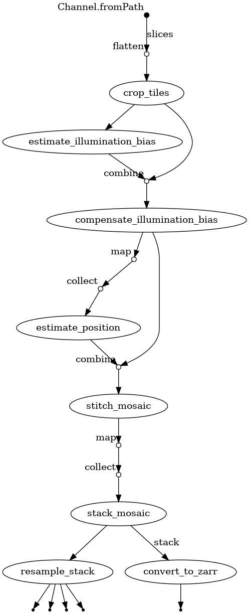

# Pipeline Overview


---

## Overview

The linumpy processing pipeline converts raw S-OCT (Serial Optical Coherence Tomography) microscopy data into reconstructed 3D volumes. The pipeline consists of two main stages:

1. **Preprocessing Pipeline** (`preproc_rawtiles.nf`) - Converts raw tiles to mosaic grids
2. **3D Reconstruction Pipeline** (`soct_3d_reconst.nf`) - Creates 3D volumes from mosaic grids



---

## Data Flow

```
Raw Tiles (tile_x*_y*_z*)
        ↓
┌───────────────────────────────┐
│   PREPROCESSING PIPELINE      │
│   preproc_rawtiles.nf         │
├───────────────────────────────┤
│ • Create 3D mosaic grids      │
│ • Estimate XY shifts          │
│ • Generate slice config       │
└───────────────────────────────┘
        ↓
Mosaic Grids (*.ome.zarr) + shifts_xy.csv + slice_config.csv
        ↓
┌───────────────────────────────┐
│   3D RECONSTRUCTION PIPELINE  │
│   soct_3d_reconst.nf          │
├───────────────────────────────┤
│ • Resample mosaic grids       │
│ • Fix focal curvature         │
│ • Fix illumination            │
│ • Stitch tiles in 3D          │
│ • PSF correction              │
│ • Crop at interface           │
│ • Normalize intensities       │
│ • Align to common space       │
│ • Pairwise registration       │
│ • Stack into 3D volume        │
└───────────────────────────────┘
        ↓
3D Volume (3d_volume.ome.zarr)
```

---

## Preprocessing Pipeline

### Purpose

Converts raw OCT tiles into organized mosaic grids and extracts metadata for subsequent reconstruction.

### Input

- **Raw tiles directory**: Contains `tile_x*_y*_z*` folders with raw OCT data
- **Folder structure**: Can be flat or organized by Z slice

### Output

1. **Mosaic grids**: `mosaic_grid_3d_z{slice_id}.ome.zarr` files
2. **XY shifts file**: `shifts_xy.csv` containing pairwise slice shifts
3. **Slice config** (optional): `slice_config.csv` for controlling slice selection

### Key Parameters

| Parameter | Default | Description |
|-----------|---------|-------------|
| `input` | (required) | Raw tiles directory |
| `output` | `"output"` | Output directory |
| `processes` | `1` | Number of parallel processes |
| `max_cpus` | `null` | Maximum CPUs to use (null = auto) |
| `reserved_cpus` | `2` | CPUs to keep free for overhead |
| `axial_resolution` | `1.5` | Axial resolution in microns |
| `resolution` | `-1` | Output resolution (-1 = full) |
| `sharding_factor` | `4` | Zarr sharding factor |
| `fix_galvo_shift` | `true` | Enable galvo shift detection and correction |
| `fix_camera_shift` | `false` | Correct camera shifts (old data) |
| `galvo_confidence_threshold` | `0.6` | Minimum confidence to apply galvo fix |
| `generate_slice_config` | `true` | Generate slice_config.csv |
| `generate_previews` | `false` | Generate orthogonal view previews |
| `detect_galvo` | `false` | Include galvo detection in slice_config.csv |
| `use_gpu` | `true` | Enable GPU acceleration (auto-fallback to CPU) |

### Processes

1. **create_mosaic_grid**: Creates 3D OME-Zarr mosaic from raw tiles
2. **estimate_xy_shifts_from_metadata**: Extracts XY shifts from tile metadata
3. **generate_slice_config**: Creates slice configuration file

### Galvo Shift Correction

The galvo mirror in OCT systems can introduce horizontal banding artifacts. During acquisition, the galvo mirror sweeps across the sample and then returns to its starting position. Data collected during this "return" period creates a distinctive intensity discontinuity if not handled correctly.

**How it works:**
- When `fix_galvo_shift = true`, each tile is analyzed for galvo artifacts
- The detection algorithm analyzes the Average Intensity Projection (AIP) of each raw tile
- It looks for **intensity discontinuities** at the galvo return region boundaries
- Detection uses **absolute intensity difference** (the return region can be brighter OR darker)
- A **confidence score** (0-1) indicates how certain the artifact is present
- The correction is **only applied if confidence ≥ threshold** (default 0.3)

**Detection algorithm details:**
- Computes three metrics: boundary contrast (50%), edge sharpness (30%), anomaly score (20%)
- Boundary contrast: How different is the return region intensity from surrounding image?
- Edge sharpness: Are there sharp transitions at the expected boundary locations?
- Anomaly score: Is the return region statistically different (z-score > 1.5)?

**When to use:**
- Set `fix_galvo_shift = true` for acquisitions that may contain galvo artifacts (most new data)
- Set `fix_galvo_shift = false` if you know the data is clean (skips detection entirely)
- Adjust `galvo_confidence_threshold` if needed:
  - Lower (e.g., 0.4): More aggressive, applies fix more often
  - Higher (e.g., 0.7): More conservative, only fixes obvious artifacts

**Note:** The artifact appears differently in raw tiles vs. stitched mosaics. In raw tiles, it's an intensity band at the return position. In stitched images, it appears as horizontal banding across the full mosaic.

---

## 3D Reconstruction Pipeline

### Purpose

Processes mosaic grids through multiple correction and stitching steps to produce a final 3D volume.

### Input

1. **Mosaic grids**: `mosaic_grid*_z*.ome.zarr` files
2. **XY shifts file**: `shifts_xy.csv`
3. **Slice config** (optional): `slice_config.csv`

### Output

1. **3D volume**: `3d_volume.ome.zarr`
2. **Compressed volume**: `3d_volume.ome.zarr.zip`
3. **Preview image**: `3d_volume.png`

### Processing Steps

#### 1. Resampling (Optional)

```
resample_mosaic_grid
```
- Resamples mosaic grids to target resolution
- Skip if `resolution = -1`

#### 2. Focal Curvature Correction (Optional)

```
fix_focal_curvature
```
- Detects and compensates for focal plane curvature
- Enabled by `fix_curvature_enabled = true`

#### 3. Illumination Correction (Optional)

```
fix_illumination
```
- Compensates for XY illumination inhomogeneity
- Uses BaSiC algorithm
- Enabled by `fix_illum_enabled = true`

#### 4. Average Intensity Projection

```
generate_aip
```
- Creates 2D AIP from 3D mosaic for registration

#### 5. XY Transformation Estimation

```
estimate_xy_transformation
```
- Estimates tile positions from AIP mosaic grid

#### 6. 3D Stitching

```
stitch_3d
```
- Stitches tiles into 3D slice using estimated transforms

#### 7. Beam Profile Correction

```
beam_profile_correction
```
- Model-free PSF compensation
- Corrects axial intensity variations

#### 8. Interface Cropping

```
crop_interface
```
- Crops volume below sample interface
- Removes agarose/mounting medium

#### 9. Intensity Normalization

```
normalize
```
- Normalizes intensities per slice
- Compensates signal attenuation with depth

#### 10. Common Space Alignment

```
bring_to_common_space
```
- Aligns all slices using XY shifts from microscope metadata
- Resamples to common shape
- **Outlier Filtering** (enabled by default):
  - Detects erroneous large shifts using IQR statistics
  - Replaces outliers with local median of neighboring shifts
  - Prevents slices from drifting out of the common volume
- Centers drift around the middle slice to keep tissue centered

**Key Parameters:**
- `filter_shift_outliers`: Enable outlier filtering (default: `true`)
- `outlier_method`: Detection method - `iqr` recommended (default: `'iqr'`)
- `outlier_iqr_multiplier`: IQR multiplier for detection (default: `1.5`)

**Debugging:**
- Enable `common_space_preview = true` to generate preview images
- Check `bring_to_common_space/` output directory for aligned slices

#### 11. Registration Mask Creation (Optional)

```
create_registration_masks
```
- Creates binary masks for pairwise registration
- Enabled by `create_registration_masks = true`

#### 12. Slice Registration

```
register_pairwise
```
- Registers consecutive slices to align them in 3D
- Uses phase correlation for robust initial translation estimate
- Refines with intensity-based optimization (translation, rotation, or affine)
- Falls back to identity transform if registration exceeds thresholds

The `bring_to_common_space` step (step 10) provides initial XY alignment using microscope metadata, while pairwise registration fine-tunes the alignment between adjacent slices.

#### 13. Volume Stacking

```
stack
```
- Stacks all slices into final 3D volume
- Creates multi-resolution pyramid with analysis-friendly resolutions (10, 25, 50, 100 µm)
- Optional blending between slices

### Pyramid Resolution Levels

The final 3D volume is stored as an OME-Zarr with multiple resolution levels optimized for analysis:

| Resolution | Use Case |
|------------|----------|
| 10 µm | High-resolution cellular analysis |
| 25 µm | Standard analysis resolution |
| 50 µm | Overview, atlas registration |
| 100 µm | Quick visualization, large-scale analysis |

**Note:** Only resolutions ≥ the base `resolution` parameter are included. For example, if processing at 25 µm resolution, the pyramid will contain 25, 50, and 100 µm levels.

### Key Parameters

| Parameter | Default | Description |
|-----------|---------|-------------|
| `input` | `"."` | Input mosaic grids directory |
| `shifts_xy` | `"$input/shifts_xy.csv"` | XY shifts file |
| `slice_config` | `""` | Optional slice config file |
| `output` | `"."` | Output directory |
| `resolution` | `10` | Target resolution (µm/pixel) |
| `clip_percentile_upper` | `99.9` | Upper percentile for clipping |
| `fix_curvature_enabled` | `true` | Enable focal curvature fix |
| `fix_illum_enabled` | `true` | Enable illumination fix |
| `crop_interface_out_depth` | `600` | Crop depth in microns |
| `create_registration_masks` | `true` | Create registration masks |
| `registration_transform` | `'translation'` | Transform type: 'translation', 'euler', or 'affine' |
| `registration_metric` | `'CC'` | Registration metric: 'MSE', 'CC', or 'MI' |
| `registration_max_translation` | `30.0` | Max allowed translation (pixels) |
| `registration_max_rotation` | `2.0` | Max allowed rotation (degrees) |
| `stack_blend_enabled` | `false` | Enable blending |
| `pyramid_resolutions` | `[10, 25, 50, 100]` | Pyramid resolution levels (µm) |
| `use_gpu` | `true` | Enable GPU acceleration (auto-fallback to CPU) |

### Registration Algorithm

The pairwise registration uses a two-step approach:

1. **Phase Correlation**: FFT-based estimation of translation between slices. Fast and robust to intensity variations.

2. **Intensity-Based Refinement**: Gradient descent optimization using the specified metric (CC recommended for OCT data).

3. **Validation**: If the estimated transform exceeds `registration_max_translation` or `registration_max_rotation`, it falls back to identity (no correction).

**Recommendations:**
- Use `translation` transform unless rotation is needed between slices
- Keep `registration_max_translation` low (20-30 pixels) to trust microscope positions
- CC (correlation coefficient) is the most robust metric for OCT data


---

## GPU Acceleration

Both pipelines support optional GPU acceleration using NVIDIA CUDA via CuPy. GPU acceleration is enabled by default (`use_gpu = true`) and automatically falls back to CPU if no GPU is available.

### GPU-Accelerated Processes

| Pipeline | Process | GPU Operations |
|----------|---------|----------------|
| Preprocessing | `create_mosaic_grid` | Galvo detection, volume resize |
| 3D Reconstruction | `generate_aip` | Mean projection |
| 3D Reconstruction | `estimate_xy_transformation` | Phase correlation (FFT) |
| 3D Reconstruction | `create_registration_masks` | Filtering, morphology |

### Running with GPU

```bash
# GPU enabled (default)
nextflow run preproc_rawtiles.nf --input /path/to/data --output /path/to/output

# Explicitly disable GPU
nextflow run preproc_rawtiles.nf --input /path/to/data --output /path/to/output --use_gpu false
```

### Requirements

- NVIDIA GPU with CUDA support
- CuPy installed (`pip install cupy-cuda12x`)
- See [GPU_ACCELERATION.md](GPU_ACCELERATION.md) for detailed setup

---

## Running the Pipelines

### Prerequisites

- Nextflow >= 23.10
- linumpy package installed
- Apptainer/Singularity (optional, for containerized execution)

### Preprocessing

```bash
nextflow run preproc_rawtiles.nf \
    --input /path/to/raw/tiles \
    --output /path/to/output \
    --processes 4
```

### 3D Reconstruction

```bash
nextflow run soct_3d_reconst.nf \
    --input /path/to/mosaic/grids \
    --shifts_xy /path/to/shifts_xy.csv \
    --output /path/to/output
```

### With Slice Config (Subset of Slices)

```bash
nextflow run soct_3d_reconst.nf \
    --input /path/to/mosaic/grids \
    --shifts_xy /path/to/shifts_xy.csv \
    --slice_config /path/to/slice_config.csv \
    --output /path/to/output
```

---

## Quality Metrics and Reporting

The pipeline automatically collects quality metrics at each processing step to help identify potential issues. At the end of the run, a comprehensive HTML report is generated.

### Collected Metrics

| Step | Metrics Collected |
|------|-------------------|
| **XY Transform Estimation** | Tile pairs used, transform matrix, estimated overlap, RMS residual |
| **Create Masks** | Mask coverage, per-slice coverage, min/std slice coverage |
| **Crop Interface** | Interface depth (voxels/µm), crop indices, interface quality |
| **PSF Compensation** | PSF max, peak depth, agarose coverage, profile quality |
| **Normalize Intensities** | Agarose coverage, Otsu threshold, background stats |
| **Pairwise Registration** | Registration error, translation (x/y), rotation, z-drift |
| **Stack Slices** | Total depth, mean/std z-offsets, z-offset range |

### Quality Thresholds

Metrics are automatically evaluated against configurable thresholds:

- **OK** (green): Value within acceptable range
- **Warning** (yellow): Value approaching problematic range
- **Error** (red): Value indicates likely issue

### Report Parameters

| Parameter | Default | Description |
|-----------|---------|-------------|
| `generate_report` | `true` | Generate quality report at end of pipeline |
| `report_verbose` | `false` | Include detailed per-file metrics |

### Generating Reports Manually

You can regenerate reports from existing metrics files:

```bash
# HTML report (recommended)
linum_generate_pipeline_report.py /path/to/pipeline/output report.html --format html

# Text report
linum_generate_pipeline_report.py /path/to/pipeline/output report.txt --format text

# Verbose report with all details
linum_generate_pipeline_report.py /path/to/pipeline/output report.html --verbose
```

### Interpreting the Report

1. **Summary Section**: Shows overall status (OK/Warnings/Errors) and counts
2. **Per-Step Sections**: Statistics and issues for each pipeline step
3. **Warnings/Errors**: Specific metrics that exceeded thresholds

Common issues indicated by metrics:
- High registration error → Check slice alignment
- Large z-offset variance → Inconsistent slice thickness or registration problems
- Low mask coverage → Segmentation issues or sparse tissue
- High translation magnitude → Significant sample drift between slices

---

## Error Handling

### Common Issues

1. **Missing shifts file**: Ensure `shifts_xy.csv` exists and contains all required slices
2. **Slice mismatch**: Use `slice_config.csv` to exclude problematic slices
3. **Memory issues**: Reduce `processes` parameter or increase available memory
4. **Registration failures**: Try different `pairwise_transform` or `pairwise_registration_metric`

### Slice Selection

When working with a subset of slices:

1. Generate slice config: `linum_generate_slice_config.py`
2. Edit `slice_config.csv` to set `use=false` for excluded slices
3. Run reconstruction with `--slice_config` parameter

---

## Output Structure

```
output/
├── README/
│   └── readme.txt                    # Pipeline parameters
├── resample_mosaic_grid/             # Resampled mosaics (if enabled)
├── fix_focal_curvature/              # Curvature-corrected mosaics
├── fix_illumination/                 # Illumination-corrected mosaics
├── generate_aip/                     # AIP projections
├── estimate_xy_transformation/       # XY transforms
├── stitch_3d/                        # Stitched 3D slices
├── beam_profile_correction/          # PSF-corrected slices
├── crop_interface/                   # Cropped slices
├── normalize/                        # Normalized slices
├── bring_to_common_space/            # Aligned slices
├── create_registration_masks/        # Registration masks (with *_metrics.json)
├── register_pairwise/                # Pairwise transforms (with *_metrics.json)
├── stack/
│   ├── 3d_volume.ome.zarr           # Final 3D volume
│   ├── 3d_volume.ome.zarr.zip       # Compressed volume
│   └── 3d_volume.png                # Preview image
└── {subject}_quality_report.html     # Quality report
```
