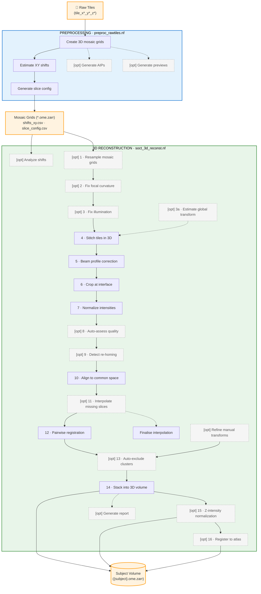

# Pipeline Overview


---

## Overview

The linumpy processing pipeline converts raw S-OCT (Serial Optical Coherence Tomography) microscopy data into reconstructed 3D volumes. The pipeline consists of two main stages:

1. **Preprocessing Pipeline** (`preproc_rawtiles.nf`) - Converts raw tiles to mosaic grids
2. **3D Reconstruction Pipeline** (`soct_3d_reconst.nf`) - Creates 3D volumes from mosaic grids

---

## Data Flow



---

## Preprocessing Pipeline

### Purpose

Converts raw OCT tiles into organized mosaic grids and extracts metadata for subsequent reconstruction.

### Input

- **Raw tiles directory**: Contains `tile_x*_y*_z*` folders with raw OCT data
- **Folder structure**: Can be flat or organized by Z slice

### Output

1. **Mosaic grids**: `mosaic_grid_3d_z{slice_id}.ome.zarr` files
2. **XY shifts file**: `shifts_xy.csv` containing pairwise slice shifts
3. **Slice config** (optional): `slice_config.csv` for controlling slice selection

### Key Parameters

| Parameter | Default | Description |
|-----------|---------|-------------|
| `input` | (required) | Raw tiles directory |
| `output` | `"output"` | Output directory |
| `use_gpu` | `true` | Enable GPU acceleration (auto-fallback to CPU) |
| `processes` | `1` | Parallel Python processes per task (CPU mode only) |
| `max_cpus` | `null` | Maximum CPUs to use (null = auto) |
| `reserved_cpus` | `2` | CPUs to keep free for overhead |
| `max_mosaic_forks` | `4` | Max concurrent `create_mosaic_grid` GPU jobs |
| `max_aip_forks` | `4` | Max concurrent `generate_aip` GPU jobs |
| `axial_resolution` | `1.36` | Axial resolution in microns |
| `resolution` | `-1` | Output resolution (-1 = full native resolution) |
| `sharding_factor` | `4` | Zarr sharding factor |
| `fix_galvo_shift` | `true` | Enable galvo shift detection and correction |
| `fix_camera_shift` | `false` | Correct camera shifts (old data) |
| `preprocess` | `false` | Apply rotation/flip preprocessing (true for legacy data) |
| `galvo_confidence_threshold` | `0.6` | Minimum confidence to apply galvo fix |
| `generate_slice_config` | `true` | Generate slice_config.csv |
| `exclude_first_slices` | `1` | Number of leading slices to mark as excluded in slice_config |
| `detect_galvo` | `false` | Include galvo detection results in slice_config.csv |
| `generate_previews` | `false` | Generate orthogonal view previews of mosaic grids |
| `generate_aips` | `false` | Generate AIP images from mosaic grids for QC |

### Processes

1. **create_mosaic_grid**: Creates 3D OME-Zarr mosaic from raw tiles
2. **estimate_xy_shifts_from_metadata**: Extracts XY shifts from tile metadata
3. **generate_slice_config**: Creates slice configuration file
4. **generate_aip** *(optional, `generate_aips = true`)*: Generates AIP images for QC visualisation
5. **generate_mosaic_preview** *(optional, `generate_previews = true`)*: Generates orthogonal view previews

### Galvo Shift Correction

The galvo mirror in OCT systems can introduce horizontal banding artifacts. During acquisition, the galvo mirror sweeps across the sample and then returns to its starting position. Data collected during this "return" period creates a distinctive intensity discontinuity if not handled correctly.

**How it works:**
- When `fix_galvo_shift = true`, each tile is analyzed for galvo artifacts
- The detection algorithm analyzes the Average Intensity Projection (AIP) of each raw tile
- It looks for **intensity discontinuities** at the galvo return region boundaries
- Detection uses **absolute intensity difference** (the return region can be brighter OR darker)
- A **confidence score** (0-1) indicates how certain the artifact is present
- The correction is **only applied if confidence ≥ threshold** (default 0.6)

**Detection algorithm details:**
- Computes three metrics: boundary contrast (50%), edge sharpness (30%), anomaly score (20%)
- Boundary contrast: How different is the return region intensity from surrounding image?
- Edge sharpness: Are there sharp transitions at the expected boundary locations?
- Anomaly score: Is the return region statistically different (z-score > 1.5)?

**When to use:**
- Set `fix_galvo_shift = true` for acquisitions that may contain galvo artifacts (most new data)
- Set `fix_galvo_shift = false` if you know the data is clean (skips detection entirely)
- Adjust `galvo_confidence_threshold` if needed:
  - Lower (e.g., 0.4): More aggressive, applies fix more often
  - Higher (e.g., 0.7): More conservative, only fixes obvious artifacts

**Note:** The artifact appears differently in raw tiles vs. stitched mosaics. In raw tiles, it's an intensity band at the return position. In stitched images, it appears as horizontal banding across the full mosaic.

---

## 3D Reconstruction Pipeline

### Purpose

Processes mosaic grids through multiple correction and stitching steps to produce a final 3D volume.

### Input

1. **Mosaic grids**: `mosaic_grid*_z*.ome.zarr` files
2. **XY shifts file**: `shifts_xy.csv`
3. **Slice config** (optional): `slice_config.csv`

### Output

1. **3D volume**: `{subject_name}.ome.zarr` (subject auto-extracted from input path; override with `subject_name` param)
2. **Compressed volume**: `{subject_name}.ome.zarr.zip`
3. **Preview images**: `{subject_name}.png`, `{subject_name}_annotated.png`; per-slice previews in `common_space_previews/` and `previews/stitched_slices/`; atlas preview in `align_to_ras/` (when `align_to_ras_enabled = true`)

### Processing Steps

#### 1. Resampling (Optional)

```
resample_mosaic_grid
```
- Resamples mosaic grids to target resolution
- Skip if `resolution = -1`

#### 2. Focal Curvature Correction (Optional)

```
fix_focal_curvature
```
- Detects and compensates for focal plane curvature
- Enabled by `fix_curvature_enabled = true`

#### 3. Illumination Correction (Optional)

```
fix_illumination
```
- Compensates for XY illumination inhomogeneity
- Uses BaSiC algorithm
- Enabled by `fix_illum_enabled = true`

#### 4. 3D Stitching

```
stitch_3d_with_refinement
```
- Internally computes the per-tile AIP, estimates tile positions via phase correlation (or a global transform when `stitch_global_transform = true`), then stitches tiles into a 3D slice
- Tile blending is controlled by `stitch_blending_method` (default: `'diffusion'`); sub-pixel refinement by `max_blend_refinement_px`
- Motor-only stitching is available for diagnostics via `motor_only_stitch = true`

#### 5. Beam Profile Correction

```
beam_profile_correction
```
- Model-free PSF compensation
- Corrects axial intensity variations

#### 6. Interface Cropping

```
crop_interface
```
- Crops volume below sample interface
- Removes agarose/mounting medium

#### 7. Intensity Normalization

```
normalize
```
- Normalizes intensities per slice
- Compensates signal attenuation with depth

#### 8. Auto Slice Quality Assessment (Optional)

```
auto_assess_quality
```
- Runs GPU-accelerated quality scoring on all normalized slices
- Enabled by `auto_assess_quality = true`
- Stamps quality scores into `slice_config.csv`; slices below `auto_assess_min_quality` are marked `auto_excluded`
- Any existing manually-excluded slices are preserved (merged with the incoming config)

**Key Parameters:**
- `auto_assess_quality`, `auto_assess_min_quality`, `auto_assess_exclude_first`, `auto_assess_roi_size`

#### 9. Re-homing Detection (Optional)

```
detect_rehoming_events
```
- Corrects encoder-glitch spikes and mosaic-column expansion jumps in `shifts_xy.csv` before common-space alignment
- Enabled by `detect_rehoming = true` (default)
- **Spike correction**: a step that self-cancels with the adjacent step is zeroed
- **Tile FOV correction** (`tile_fov_mm`): genuine re-homing events that are integer multiples of the tile FOV are preserved and corrected in position space
- Outputs `shifts_xy_clean.csv` with a `reliable` column; `reliable=0` flags transitions that exceeded `rehoming_max_shift_mm` and may need image-based verification

**Key Parameters:**
- `detect_rehoming`, `rehoming_return_fraction`, `rehoming_max_shift_mm`
- `tile_fov_mm` (legacy shifts only)
- `rehoming_diagnostics` — write `rehoming_report.json` + diagnostic plot

#### 10. Common Space Alignment

```
bring_to_common_space
```
- Aligns all slices using (optionally corrected) XY shifts from microscope metadata
- Resamples to a shared canvas; centres drift around the middle slice to keep tissue in the common volume
- **Excluded-slice handling**: shifts involving excluded slices are replaced using the neighbours (`local_median` by default)
- **Optional image-based refinement** (`common_space_refine_unreliable`) uses 2-D phase correlation to recompute shifts flagged `reliable=0`

**Key Parameters:**
- `common_space_refine_unreliable` + `common_space_refine_min_correlation` + `common_space_refine_max_discrepancy_px`
- `common_space_excluded_slice_mode` (`keep` | `local_median` | `median` | `zero`)

**Debugging:**
- Enable `common_space_preview = true` for aligned-slice previews
- Check `bring_to_common_space/` for the aligned slices

#### 11. Missing Slice Interpolation (Optional)

```
interpolate_missing_slice
```
- Fills single-slice gaps using the two neighbouring slices
- Enabled by `interpolate_missing_slices = true` (default)
- Default method is **zmorph** (z-aware morphing via fractional affine
  transforms on the boundary planes) — see [SLICE_INTERPOLATION_FEATURE.md](SLICE_INTERPOLATION_FEATURE.md)
- When zmorph's quality gates fail the slot stays a genuine gap (no zarr
  emitted) — nothing is fabricated
- `finalise_interpolation` merges per-slice manifest fragments into
  `slice_config_final.csv`

#### 12. Slice Registration

```
register_pairwise
```
- Registers consecutive slices to align them in 3D
- Finds the best matching Z-plane using zero-lag NCC (Pearson correlation) over a centre-cropped ROI
- XY alignment is seeded from motor positions; only small corrections are computed
- Refines with SimpleITK gradient descent (translation, or rotation + translation via `euler` transform)
- Falls back to identity transform if registration exceeds thresholds

The `bring_to_common_space` step (step 10) provides initial XY alignment using microscope metadata, while pairwise registration fine-tunes the alignment between adjacent slices.

#### 13. Auto-Exclude Clusters (Optional)

```
auto_exclude_slices
```
- Detects clusters of consecutive low-quality pairwise registrations using DBSCAN on registration metrics (NCC, translation magnitude)
- Enabled by `auto_exclude_quality = true`
- Stamps `auto_excluded` / `auto_exclude_reason` into `slice_config.csv`; stacking falls back to motor-only positioning for excluded slices

**Key Parameters:**
- `auto_exclude_quality`, `auto_exclude_consecutive`, `auto_exclude_z_corr`

#### 14. Volume Stacking

```
stack
```
- Stacks all slices into final 3D volume
- Creates multi-resolution pyramid with analysis-friendly resolutions (10, 25, 50, 100 µm)
- Optional blending between slices
- XY positions from motor encoder data (`shifts_xy.csv`), Z from correlation matching
- Pairwise registration transforms refine rotation and (optionally) translation
- Confidence-based transform degradation: high-confidence pairs get full transforms, low-confidence get rotation-only, very low get skipped
- Translation accumulation steers the viewing plane to reduce inter-slice drift

#### 15. Z-Intensity Normalization (Optional)

```
normalize_z_intensity
```
- Corrects slow intensity drift across serial sections after stacking
- Enabled by `normalize_z_slices = true`
- Two modes: `histogram` (preserves relative tissue contrast) or `percentile` (linear scaling)
- Controlled by `znorm_strength` (0 = passthrough, 1 = full correction)

#### 16. Atlas Registration (Optional)

```
align_to_ras
```
- Registers the final 3D volume to RAS orientation via rigid registration to the Allen Mouse Brain Atlas (CCF)
- Enabled by `align_to_ras_enabled = true`
- Atlas data is downloaded automatically at the specified resolution (10/25/50/100 µm)
- Input volume orientation must be specified via `ras_input_orientation` (see [RAS Orientation Lookup Table](NEXTFLOW_WORKFLOWS.md#ras-orientation-lookup-table))
- Output is an OME-Zarr at all pyramid resolutions in RAS space

### Pyramid Resolution Levels

The final 3D volume is stored as an OME-Zarr with multiple resolution levels optimized for analysis:

| Resolution | Use Case |
|------------|----------|
| 10 µm | High-resolution cellular analysis |
| 25 µm | Standard analysis resolution |
| 50 µm | Overview, atlas registration |
| 100 µm | Quick visualization, large-scale analysis |

**Note:** Only resolutions ≥ the base `resolution` parameter are included. For example, if processing at 25 µm resolution, the pyramid will contain 25, 50, and 100 µm levels.

### Key Parameters

| Parameter | Default | Description |
|-----------|---------|-------------|
| `input` | `"."` | Input mosaic grids directory |
| `shifts_xy` | `""` | XY shifts file (default: `{input}/shifts_xy.csv`) |
| `slice_config` | `""` | Optional slice config file |
| `output` | `"."` | Output directory |
| `resolution` | `10` | Target resolution (µm/pixel) |
| `clip_percentile_upper` | `99.9` | Upper percentile for clipping |
| `fix_curvature_enabled` | `false` | Enable focal curvature fix |
| `fix_illum_enabled` | `true` | Enable illumination fix |
| `crop_interface_out_depth` | `600` | Crop depth in microns |
| `use_motor_positions_for_stitching` | `true` | Use motor encoder positions for tile layout |
| `stitch_overlap_fraction` | `0.2` | Expected tile overlap fraction |
| `stitch_blending_method` | `'diffusion'` | Tile blending: `'none'`, `'average'`, `'diffusion'` |
| `max_blend_refinement_px` | `10` | Maximum sub-pixel refinement shift during blending (pixels) |
| `registration_transform` | `'euler'` | Transform type: `euler` (XY + rotation) or `translation` |
| `registration_max_translation` | `200.0` | Optimizer bound on translation (pixels) |
| `registration_max_rotation` | `5.0` | Optimizer bound on rotation (degrees) |
| `stack_blend_enabled` | `true` | Enable blending between slices |
| `apply_rotation_only` | `false` | Apply only rotation from pairwise registration during stacking |
| `stack_accumulate_translations` | `true` | Accumulate pairwise translations as cumulative canvas offsets |
| `stack_confidence_weight_translations` | `true` | Weight translations by confidence before accumulating |
| `stack_max_cumulative_drift_px` | `50` | Max cumulative drift from motor baseline (0 = unlimited) |
| `interpolation_blend_method` | `'gaussian'` | Blend method: `gaussian` (feathered) or `linear` |
| `normalize_z_slices` | `false` | Enable post-stacking Z-intensity normalization |
| `pyramid_resolutions` | `[10, 25, 50, 100]` | Pyramid resolution levels (µm) |
| `pyramid_make_isotropic` | `true` | Resample to isotropic voxel spacing |
| `use_gpu` | `true` | Enable GPU acceleration (auto-fallback to CPU) |

### Registration Algorithm

The pairwise registration uses a two-step approach:

1. **Z-Plane Matching**: The best-matching Z-plane in the fixed volume is found by scanning a search range around the expected position and scoring each candidate with zero-lag NCC (Pearson correlation) computed on a centre-cropped ROI. XY initial alignment comes from motor encoder positions.

2. **Intensity-Based Refinement**: SimpleITK gradient descent with a Pearson correlation metric (`SetMetricAsCorrelation`) using a multiscale pyramid. The transform type is controlled by `registration_transform`: `euler` (rotation + translation) or `translation` (XY only).

3. **Transform application** (motor stacking): When `apply_rotation_only = true` only the rotation component is used during stacking; XY translation comes from motor positions. Rotation is clamped to `max_rotation_deg`. Transforms flagged as `error` are skipped when `skip_error_transforms = true`.

**Recommendations:**
- Use `euler` transform to correct small rotations between slices
- Keep `registration_max_translation` large (optimizer bound only — actual corrections are controlled by `apply_rotation_only` and `max_rotation_deg`)
- Set `registration_slicing_interval_mm` to match your actual slice thickness


---

## Algorithmic Details

This section gives both an **intuitive** ("what is this doing and why") and a **mathematical** ("what does the code compute") description of each major pipeline step. Notation:

- $I(z, y, x)$ — a 3D volume indexed in (Z, Y, X) order
- $\mathrm{AIP}(y, x) = \frac{1}{N_z} \sum_z I(z, y, x)$ — average intensity projection along Z
- $\mathrm{NCC}(a, b)$ — zero-lag normalized cross-correlation (Pearson): $\frac{\sum (a - \bar{a})(b - \bar{b})}{\sqrt{\sum(a-\bar{a})^2 \cdot \sum(b-\bar{b})^2}}$
- Shifts are pixel-valued; $\delta = (\delta_y, \delta_x)$ denotes an XY translation

### Galvo Shift Correction (preprocessing)

**Intuition.** The galvo mirror scans across the sample along the A-line axis; when it returns to its starting position the detector still records a few lines. These lines sit at a slightly different optical state, so they form a dark (or sometimes bright) **band** at a fixed position in every tile. If not removed, the band propagates into the stitched mosaic as a horizontal stripe.

**Math.** Given the per-tile AIP $A \in \mathbb{R}^{N_a \times N_b}$ (A-lines × B-scans), let $\bar{A}(y) = \mathrm{mean}_x A(y, x)$ be the B-scan–averaged 1D profile (median-filtered, size 5). The window $[p, p+w)$ is found by one of two paths depending on data availability:

**Path 1 — raw `.bin` tiles** (window width $w = n_\text{extra}$ known from acquisition metadata):
The position $p$ is found by matching a pair of large gradients separated by exactly $w$ pixels:
$$
\mathbf{g}(y) = |\bar{A}(y+1) - \bar{A}(y)|, \qquad
p = \arg\max_{y} \; \mathbf{g}(y) \cdot \mathbf{g}(y + w).
$$
The product is large only where two sharp edges occur exactly $w$ apart — the entry and exit of the galvo return zone. The corrective circular shift is $s = N_a - p - w$ (moves the window to the end of the A-line axis).

**Path 2 — assembled mosaic tiles** (neither $p$ nor $w$ is known a priori):
A robust tissue baseline $b_{75} = P_{75}(\bar{A})$ is computed (75th percentile sits above the dark band but below saturation). Pixels below $b_{75}(1 - f_\text{drop})$ (default $f_\text{drop} = 0.40$) are marked as dark. Consecutive dark runs separated by $\le 2$ pixels are merged; the group with the largest cumulative intensity deficit $\sum_y (b_{75}(1-f_\text{drop}) - \bar{A}(y))^+$ is selected as $[p, p+w)$. Groups wider than $0.2\,N_a$ are rejected as non-galvo structure (e.g. tissue boundary).

**Confidence scoring** (both paths). Once $[p, p+w)$ is established, three components are computed over $N_c \le 20$ representative columns:

1. **Boundary contrast** — mean relative intensity drop of the band vs. surrounding rows
   $$
   c_b = \frac{1}{N_c}\sum_{j=1}^{N_c} \max\!\left(0,\frac{\bar{A}_\text{sur}(j) - \bar{A}_\text{band}(j)}{\bar{A}_\text{sur}(j)}\right)
   $$
2. **Significant drop ratio** — fraction of columns where the relative drop exceeds 10 %
3. **Average drop depth** — mean relative drop across dark columns, normalised to 0.3

Combined: $C = 0.40\,c_b + 0.35\,c_s + 0.25\,c_d \in [0, 1]$ (columns with $\bar{A}_\text{sur} < 10$ are excluded). If column consistency $c_b < 0.5$ the score is capped at $0.3 \cdot c_b$ to reject spurious detections in sparse tiles.

The corrective circular shift is only applied when $C \ge$ `galvo_confidence_threshold`. For multi-tile slices (Path 1), up to 5 centre-region tiles are sampled and the best-confidence detection is penalised by a cross-tile consistency factor $\sqrt{n_\text{consistent}/n_\text{sampled}}$ before thresholding.

---

### Focal Curvature Correction

**Intuition.** The focal plane of the OCT objective is not flat — it bends slightly, so the tissue–water interface appears as a curved surface in the reconstructed volume even when the physical surface is flat. The correction fits a smooth surface to this apparent interface and resamples each A-line so the surface becomes flat.

**Math.** Detect the interface depth map $z_0(y, x) = \arg\max_z \partial_z I(z, y, x)$ (after Gaussian smoothing). Fit a quadratic surface
$$
\hat{z}_0(y, x) = a + by + cx + dy^2 + exy + fx^2,
$$
and shift each A-line so that $z'(y, x) = z - (\hat{z}_0(y, x) - \min \hat{z}_0)$. The shift is per-pixel; pixels that fall off the bottom are zero-padded.

---

### Illumination Correction (BaSiC)

**Intuition.** Each tile has a slowly varying brightness shading from the illumination profile — typically brighter in the centre and darker at the corners. BaSiC learns this shading pattern jointly across all tiles by assuming it's a smooth, low-rank flat-field that multiplies the true signal.

**Math.** Given a stack of tile AIPs $A_i$, BaSiC solves
$$
\min_{F, D, B_i} \quad \sum_i \| A_i - (F \odot B_i + D)\|_1 + \lambda_F \|F\|_* + \lambda_D \|D\|_1
$$
where $F$ is the flat-field (smooth, nuclear-norm regularised), $D$ is the dark-field, and $B_i$ is the per-tile baseline. Each tile is then corrected as $\hat{B}_i = (A_i - D) / F$. The JAX implementation runs this on GPU.

---

### XY Transform Estimation (Phase Correlation)

**Intuition.** For two overlapping tiles, their correct relative offset is the one that makes them most similar. Phase correlation finds this offset in Fourier space: a translation in real space is a linear phase in frequency, so the cross-power spectrum has a sharp peak at the correct shift.

**Math.** For overlapping AIP patches $a, b$:
$$
R(\xi) = \mathcal{F}^{-1}\!\left\{ \frac{\mathcal{F}(a)\,\overline{\mathcal{F}(b)}}{|\mathcal{F}(a)\,\overline{\mathcal{F}(b)}|} \right\}, \qquad \hat{\delta} = \arg\max_{\xi} R(\xi).
$$
The top-$n$ peaks are returned (see `phase_correlation`), then consensus-filtered to reject spurious peaks caused by repetitive tissue features. A residual RMS across all tile pairs is logged as a quality metric.

---

### 3D Stitching with Diffusion Blending

**Intuition.** Pasting tiles next to each other with a hard boundary leaves visible seams because neighbouring tiles never have exactly the same brightness. Diffusion blending treats the overlap region like a heat-diffusion problem: known intensities on the tile boundaries act as Dirichlet boundary conditions, and intermediate values are obtained by solving Laplace's equation, producing a smooth transition with no visible seam.

**Math.** In each overlap region $\Omega$ with two tiles $t_1, t_2$, solve
$$
\nabla^2 u = 0 \quad \text{in } \Omega, \qquad u|_{\partial \Omega_1} = t_1, \quad u|_{\partial \Omega_2} = t_2.
$$
The sub-pixel refinement step first runs 2D phase correlation on the Z-projected overlap; if the estimated shift has magnitude $\le$ `max_blend_refinement_px` it is applied before blending (otherwise discarded as unreliable).

---

### Beam Profile Correction (Model-Free PSF)

**Intuition.** The OCT signal decays with depth because (i) the focused beam is only in focus near its waist and (ii) light is attenuated by tissue. A model-free correction estimates this depth-dependent envelope from the data itself (tissue-averaged A-line profile) and divides it out, so signal at every depth is on an equal footing.

**Math.** Let $\mathcal{M}$ be the tissue mask. Compute the tissue-averaged axial profile
$$
p(z) = \mathrm{median}_{(y,x) \in \mathcal{M}} I(z, y, x),
$$
fit a smooth envelope $\hat{p}(z)$ (parametric or low-pass), then apply $I'(z, y, x) = I(z, y, x) \cdot \bar{p} / \hat{p}(z)$ where $\bar{p}$ is the overall reference level. Pipeline metrics record the peak depth $z^\star = \arg\max \hat{p}$ and the agarose coverage used for the mask.

---

### Interface Cropping

**Intuition.** The mounting agarose above the tissue is bright and distracting. The surface of the tissue is detected as the sharpest Z-gradient (water → tissue transition) and a fixed physical depth below it is kept.

**Math.** Smooth with Gaussians $\sigma_{xy}, \sigma_z$, then for every $(y, x)$ compute $z_0(y, x) = \arg\max_z \partial_z I$. Keep only pixels where $\max_z \partial_z I > 0.1 \cdot \max(\max_z \partial_z I)$ as "tissue pixels", and take the median over those to get a single interface depth per slice. The output volume is $I[z_0 : z_0 + D]$ where $D = $ `crop_interface_out_depth` / `axial_resolution`.

---

### Per-Slice Intensity Normalization

**Intuition.** Different slices have different overall brightness (illumination power, sample state). Without correction, the stacked volume shows horizontal bands between slices. Normalization rescales each slice so a reference tissue percentile matches across slices.

**Math.** For slice $k$, compute a robust upper percentile (e.g. $p_{99}$) over **non-zero tissue voxels** above an Otsu threshold: $q_k = P_{99}(\{I_k > t_{\text{otsu}}\})$. Smooth the per-chunk values $q_k$ with a 1-D Gaussian ($\sigma = $ `smooth_sigma`) to produce $\tilde{q}_k$, then rescale
$$
I'_k = I_k \cdot \frac{Q^\star}{\tilde{q}_k}, \qquad Q^\star = \mathrm{median}_k\,\tilde{q}_k,
$$
with the multiplier clipped to $[\min\_scale, \max\_scale]$.

---

### Re-homing Detection (for `shifts_xy.csv`)

**Intuition.** Two kinds of large pairwise motor shifts occur:

- **Re-homing event** — the microscope moved to a new tissue region; the big step *stays* (subsequent shifts are small around the new position).
- **Encoder glitch** — the encoder reported a spurious value for one slice; the following shift reverses it (round-trip ≈ 0).

We only want to correct glitches.

**Math.** For each pairwise step $s_i = (\Delta x_i, \Delta y_i)$ with $|s_i| > $ `max_shift_mm`, check its neighbours. Step $s_i$ is classified as a **glitch spike** iff
$$
\exists j \in \{i-1, i+1\} : \| s_i + s_j \| < f_\text{return} \cdot \|s_i\|,
$$
with $f_\text{return} = $ `rehoming_return_fraction` (default 0.4). Glitches are replaced by the local median of their non-outlier neighbours; re-homing events are left unchanged. Steps flagged `reliable=0` are those that were corrected or exceeded thresholds.

---

### Common-Space Alignment

**Intuition.** Each slice was acquired at a motor position, but we need every slice to live in the same global canvas. We integrate the pairwise shifts into cumulative positions, centre the sequence so the middle slice is at the canvas centre, and paint each slice into its assigned location.

**Math.** Given cleaned pairwise shifts $s_i$ (mm), the cumulative position is $C_k = \sum_{i \le k} s_i$. Convert to pixels, $P_k = C_k / r$ where $r$ is resolution in mm/pixel, then centre:
$$
P'_k = P_k - P_{k_\text{mid}}.
$$
Excluded slices' shifts are replaced by the local median of their neighbours before integration (`common_space_excluded_slice_mode = local_median`). Optionally, transitions with `reliable = 0` are re-estimated from image content by running 2D phase correlation on the neighbouring AIPs (`common_space_refine_unreliable`), provided the best peak correlation exceeds `common_space_refine_min_correlation`.

---

### Missing Slice Interpolation (zmorph)

**Intuition.** When a slice is missing or excluded we want to fill the gap with a synthetic slice that *morphs* from the slice above to the slice below rather than simply averaging them (averaging creates ghost/double-contour artefacts if the two neighbours differ). zmorph registers the two neighbours with an affine transform, then for each output plane at a fractional depth $\alpha \in [0,1]$ warps each boundary by the appropriate fractional power of that transform and cross-fades.

**Math.** Register the after-boundary slice $B_\text{after}$ to the before-boundary slice $B_\text{before}$ to obtain the 2D affine $T$ (matrix $M$, translation $t$). For output plane $\alpha \in (0, 1)$:
$$
P_\alpha(\mathbf{x}) \;=\; (1 - \alpha)\, B_\text{before}(T^{\alpha}\mathbf{x}) \;+\; \alpha\, B_\text{after}(T^{\alpha - 1}\mathbf{x}),
$$
where the fractional affine $T^{\alpha}$ is built from the **matrix fractional power** $M^{\alpha}$ and a translation component $t_{\alpha} = (I - M^{\alpha})(I - M)^{-1}\,t$ (equivalently $(M^{\alpha} - I)(M - I)^{-1}\,t$). $M^{\alpha}$ is computed via `scipy.linalg.fractional_matrix_power` (Schur decomposition internally); the real part is kept and the max relative imaginary magnitude is tracked as a diagnostic (warning emitted above $10^{-3}$), and affines with $\det(M) \le 0$ are rejected upstream. When $I - M$ is near-singular (pure translation) the code falls back to the exact linear form $t_{\alpha} \approx \alpha\,t$.

**Quality gates** that force a hard skip (no volume emitted):
- Overlap $\mathrm{NCC}(B_\text{before}, B_\text{after}) < $ `min_overlap_correlation`
- $\mathrm{NCC}$ improvement after registration $< $ `min_ncc_improvement`
- $\det(M) \le 0$ (reflection/degenerate)
- Registration exception

This is intentional — a failed interpolation leaves a real gap rather than fabricating plausible-looking tissue.

---

### Pairwise Slice Registration

**Intuition.** Two consecutive slices share a physical overlap zone (a few tens of microns of tissue). We find the Z-plane in the lower slice that best matches the top of the upper slice, then refine XY (optionally + rotation) with a gradient-descent registration.

**Math.** Step 1 — **Z-plane matching**. For each candidate offset $z^\star$ in a search range around the expected overlap,
$$
z^\star = \arg\max_{z} \mathrm{NCC}\!\left(F[z, \mathrm{crop}], M[0, \mathrm{crop}]\right),
$$
computed on a centre-cropped 25 % margin-free ROI.

Step 2 — **Intensity refinement** (SimpleITK):
$$
\hat{T} = \arg\min_{T \in \mathcal{E}} \; -\mathrm{NCC}\!\left(F_{z^\star},\ M_0 \circ T\right),
$$
with $\mathcal{E}$ = Euler2D (rotation + translation) or pure translation, optimised by regular-step gradient descent at 3 pyramid levels, learning rate $4.0$, minimum step $10^{-2}$, max $200$ iterations. Parameters are bounded by `registration_max_translation` and `registration_max_rotation`; a fallback identity transform is written whenever the bound is hit or the metric fails to improve.

---

### Volume Stacking

**Intuition.** Each slice is placed in the canvas at its motor position; the Z-overlap determined by correlation tells us how much it should intrude into the previous slice; the pairwise rotation (and optionally translation) polishes alignment; and translations are accumulated across the stack to avoid persistent drift in one direction.

**Math.**
1. **Z-overlap.** For the candidate overlaps $o \in [o_\text{exp} - \Delta, o_\text{exp} + \Delta]$ with $o_\text{exp}$ from slice thickness,
   $$
   \hat{o}_k = \arg\max_o \mathrm{NCC}\!\left(F_k[-o:, \mathrm{crop}],\ M_{k+1}[:o, \mathrm{crop}]\right).
   $$
   Outlier overlaps deviating from the median by more than `outlier_threshold_frac` are corrected from neighbours (unless the pair has high registration confidence).
2. **Translation accumulation.** Let $\tau_k$ be the XY translation from pairwise registration and $c_k$ its confidence. The cumulative canvas offset is
   $$
   u_k = \mathrm{smooth}_\sigma\!\left(\sum_{i \le k} c_i\,\tau_i\right),
   $$
   smoothed with a 1D Gaussian of standard deviation `stack_translation_smooth_sigma`. When `stack_max_cumulative_drift_px > 0`, $\|u_k\|$ is capped.
3. **Z-blend.** In the overlap region the Hann weight
   $$
   w(z) = \tfrac{1}{2}\left(1 - \cos\!\tfrac{\pi z}{n_z - 1}\right)
   $$
   is used to cross-fade: $B = (1 - w) F + w M$ where both are valid, otherwise the single-valid side is kept. Zero slope at both endpoints avoids seams.
4. **Sub-pixel refinement.** Before blending, a 2D phase correlation on the Z-projected overlap may shift the moving slice by $\le$ `max_blend_refinement_px`.

---

### Post-Stacking Z-Intensity Normalization

**Intuition.** Even after per-slice normalization a slow drift in contrast can remain across dozens of sections. This step either (a) rescales each Z-plane by a smooth factor (percentile mode) or (b) matches each plane's tissue histogram to a reference distribution (histogram mode).

**Math.** Let $h_k(v)$ be the tissue-voxel histogram of plane $k$ ($v > t_\text{tissue}$) and $H(v) = \frac{1}{K}\sum_k h_k(v)$ the reference histogram with CDF $\Phi$. Define per-plane CDF $\Phi_k$, then the mapping
$$
m_k(v) = \Phi^{-1}\!\big(\Phi_k(v)\big), \qquad v' = (1 - \alpha)\,v + \alpha\,m_k(v),
$$
with $\alpha = $ `znorm_strength` $\in [0, 1]$ controlling partial application. Percentile mode uses the simpler scaling $I'_k = I_k \cdot Q^\star / \tilde{q}_k$ (same form as per-slice normalization, but computed post-stack).

---

### Atlas / RAS Alignment

**Intuition.** The reconstructed volume has some arbitrary orientation (depends on how the sample was mounted). For comparison across subjects we need a standard frame. A rigid registration to the Allen Mouse Brain atlas (CCF, downsampled to match) finds the rotation + translation that best aligns the subject's coarse anatomy to the atlas, and we resample the subject volume into the atlas's RAS grid.

**Math.** Let $V$ be the subject volume reoriented to `ras_input_orientation` and $A$ the atlas template at matching resolution. Solve
$$
\hat{T} = \arg\min_{T \in \mathrm{SE}(3)} \; -\mathrm{NCC}(A,\ V \circ T),
$$
with a multi-resolution pyramid. The resulting `.tfm` file and the resampled OME-Zarr (at all pyramid levels) are saved alongside a 3-panel preview comparing subject-in-atlas with the atlas itself.

---

## GPU Acceleration

Both pipelines support optional GPU acceleration using NVIDIA CUDA via CuPy. GPU acceleration is enabled by default (`use_gpu = true`) and automatically falls back to CPU if no GPU is available.

### GPU-Accelerated Processes

| Pipeline | Process | GPU Operations |
|----------|---------|----------------|
| Preprocessing | `create_mosaic_grid` | Galvo detection, volume resize |
| Preprocessing | `generate_aip` | Mean projection |
| 3D Reconstruction | `resample_mosaic_grid` | Volume resize |
| 3D Reconstruction | `fix_illumination` | BaSiCPy background correction (JAX on GPU) |
| 3D Reconstruction | `normalize` | Intensity normalization, percentile clipping |

### Running with GPU

```bash
# GPU enabled (default)
nextflow run preproc_rawtiles.nf --input /path/to/data --output /path/to/output

# Explicitly disable GPU
nextflow run preproc_rawtiles.nf --input /path/to/data --output /path/to/output --use_gpu false
```

### Requirements

- NVIDIA GPU with CUDA support
- CuPy installed (`uv pip install cupy-cuda12x`)
- See [GPU_ACCELERATION.md](GPU_ACCELERATION.md) for detailed setup

---

## Running the Pipelines

### Prerequisites

- Nextflow >= 23.10
- linumpy package installed
- Apptainer/Singularity (optional, for containerized execution)

### Preprocessing

```bash
nextflow run preproc_rawtiles.nf \
    --input /path/to/raw/tiles \
    --output /path/to/output \
    --processes 4
```

### 3D Reconstruction

```bash
nextflow run soct_3d_reconst.nf \
    --input /path/to/mosaic/grids \
    --shifts_xy /path/to/shifts_xy.csv \
    --output /path/to/output
```

### With Slice Config (Subset of Slices)

```bash
nextflow run soct_3d_reconst.nf \
    --input /path/to/mosaic/grids \
    --shifts_xy /path/to/shifts_xy.csv \
    --slice_config /path/to/slice_config.csv \
    --output /path/to/output
```

---

## Quality Metrics and Reporting

The pipeline automatically collects quality metrics at each processing step to help identify potential issues. At the end of the run, a comprehensive HTML report is generated.

### Collected Metrics

| Step | Metrics Collected |
|------|-------------------|
| **XY Transform Estimation** | Tile pairs used, transform matrix, estimated overlap, RMS residual |
| **Crop Interface** | Interface depth (voxels/µm), crop indices, interface quality |
| **PSF Compensation** | PSF max, peak depth, agarose coverage, profile quality |
| **Normalize Intensities** | Agarose coverage, Otsu threshold, background stats |
| **Pairwise Registration** | Registration error, translation (x/y), rotation, z-drift |
| **Stack Slices** | Total depth, mean/std z-offsets, z-offset range |

### Quality Thresholds

Metrics are automatically evaluated against configurable thresholds:

- **OK** (green): Value within acceptable range
- **Warning** (yellow): Value approaching problematic range
- **Error** (red): Value indicates likely issue

### Report Parameters

| Parameter | Default | Description |
|-----------|---------|-------------|
| `generate_report` | `true` | Generate quality report at end of pipeline |
| `report_verbose` | `false` | Include detailed per-file metrics |

### Generating Reports Manually

You can regenerate reports from existing metrics files:

```bash
# HTML report (recommended)
linum_generate_pipeline_report.py /path/to/pipeline/output report.html --format html

# Text report
linum_generate_pipeline_report.py /path/to/pipeline/output report.txt --format text

# Verbose report with all details
linum_generate_pipeline_report.py /path/to/pipeline/output report.html --verbose
```

### Interpreting the Report

1. **Summary Section**: Shows overall status (OK/Warnings/Errors) and counts
2. **Per-Step Sections**: Statistics and issues for each pipeline step
3. **Warnings/Errors**: Specific metrics that exceeded thresholds

Common issues indicated by metrics:
- High registration error → Check slice alignment
- Large z-offset variance → Inconsistent slice thickness or registration problems
- Low mask coverage → Segmentation issues or sparse tissue
- High translation magnitude → Significant sample drift between slices

---

## Error Handling

### Common Issues

1. **Missing shifts file**: Ensure `shifts_xy.csv` exists and contains all required slices
2. **Slice mismatch**: Use `slice_config.csv` to exclude problematic slices
3. **Memory issues**: Reduce `processes` parameter or increase available memory
4. **Registration failures**: Try different `pairwise_transform` or `pairwise_registration_metric`

### Troubleshooting Reconstruction Artifacts

#### Boomerang/Curved Shape (Cumulative Drift)

**Symptoms:** Brain appears curved when viewed from the side instead of straight.

**Cause:** Small registration biases accumulate over many slices.

**Solutions:**
- Enable re-homing detection: `--detect_rehoming true` (default) to remove encoder glitch spikes
- For legacy shifts files, also set `--tile_fov_mm 0.875` (or your tile FOV) to correct mosaic-expansion jumps
- Enable image-based refinement for uncertain transitions: `--common_space_refine_unreliable true`
- Start from `-profile conservative` (rotation-only transform application, tight confidence gating)

#### Shadowing/Banding Effect

**Symptoms:** Horizontal bands visible in sagittal/coronal views; slices appear to have different sizes.

**Cause:** Inconsistent normalization, varying tissue coverage, or registration errors.

**Solutions:**
- Enable illumination correction: `--fix_illum_enabled true`
- Enable stack blending: `--stack_blend_enabled true`
- Check agarose mask quality in normalization step

#### Double Edges in Interpolated Slices

**Symptoms:** Visible edge artifacts at slice boundaries after interpolation.

**Cause:** Linear blending creates hard transitions at volume boundaries.

**Solutions:**
- Use feathered blending: `--interpolation_blend_method gaussian` (default)
- The gaussian method uses distance transform to create soft edges

### Slice Selection

When working with a subset of slices:

1. Generate slice config: `linum_generate_slice_config.py`
2. Edit `slice_config.csv` to set `use=false` for excluded slices
3. Run reconstruction with `--slice_config` parameter

---

## Output Structure

```
output/
├── README/
│   └── readme.txt                    # Pipeline parameters
├── analyze_shifts/                   # Shifts analysis report and drift plots (when analyze_shifts = true)
├── resample_mosaic_grid/             # Resampled mosaics (if enabled)
├── fix_focal_curvature/              # Curvature-corrected mosaics
├── fix_illumination/                 # Illumination-corrected mosaics
├── stitch_3d_with_refinement/        # Stitched 3D slices
├── previews/stitched_slices/         # Stitch previews (when stitch_preview = true)
├── beam_profile_correction/          # PSF-corrected slices
├── crop_interface/                   # Cropped slices
├── normalize/                        # Normalized slices
├── auto_assess_quality/              # (auto_assess_quality = true) Quality-stamped slice_config.csv
├── detect_rehoming_events/           # Corrected shifts_xy_clean.csv + diagnostics (when enabled)
├── bring_to_common_space/            # Aligned slices
├── common_space_previews/            # Common space previews (when common_space_preview = true)
├── interpolate_missing_slice/        # (interpolate_missing_slices = true)
│   ├── slice_z*.ome.zarr             #   (only when interpolation succeeded)
│   └── manifests/                    #   Per-slice CSV fragments
├── finalise_interpolation/           # slice_config_final.csv
├── register_pairwise/                # Pairwise transforms + metrics.json
├── auto_exclude_slices/              # (auto_exclude_enabled) slice_config with auto_excluded flags
├── export_manual_align/              # (export_manual_align) AIPs + transforms for manual tool
├── stack/
│   ├── {subject}.ome.zarr            # Final 3D volume
│   ├── {subject}.ome.zarr.zip        # Compressed volume
│   ├── {subject}.png                 # Preview image
│   ├── {subject}_annotated.png       # Annotated preview
│   ├── z_matches.csv                 # Z-overlap decisions
│   └── stacking_decisions.csv        # Per-slice transform loading decisions
├── normalize_z_intensity/            # (normalize_z_slices) Z-normalized volume
│   └── {subject}_znorm.ome.zarr
├── align_to_ras/                     # (align_to_ras_enabled)
│   ├── {subject}_ras.ome.zarr        #   RAS-aligned volume (all pyramid levels)
│   ├── {subject}_ras_transform.tfm   #   Registration transform (SimpleITK)
│   └── {subject}_ras_preview.png     #   3-panel alignment comparison
├── diagnostics/                      # (diagnostic_mode or individual flags)
│   ├── rotation_analysis/
│   ├── acquisition_rotation/
│   ├── motor_only_stitch/
│   ├── refined_stitch/
│   ├── motor_only_stack/
│   └── stitch_comparison/
└── {subject}_quality_report.html     # Quality report (when generate_report = true)
```
