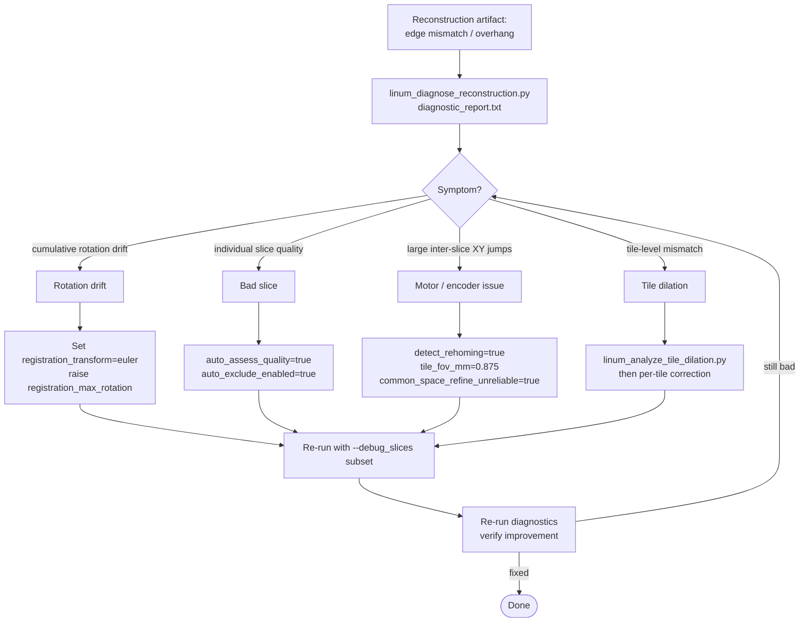

# Diagnostic Tools for 3D Reconstruction Troubleshooting

This document describes diagnostic tools for identifying and fixing reconstruction artifacts
in serial OCT microscopy data, particularly for **obliquely-mounted samples**.

## Context: Oblique Sample Mounting

Standard serial blockface histology acquisitions image samples in the three normal anatomical
directions (coronal, sagittal, axial). However, for studying how contrast changes across 
different orientations, samples can be mounted at angles relative to these standard planes
(e.g., **45° between sagittal and coronal**).

While the imaging acquisition itself is standard serial blockface histology, the oblique 
mounting introduces additional challenges for 3D reconstruction:
- Sample edges may not align with image borders
- Tissue deformation patterns differ from standard orientations
- Registration between slices may need rotation correction

## Common Artifacts and Their Causes

### Edge Mismatches / "Overhangs"
**Symptoms**: Visible discontinuities at slice boundaries, tissue edges don't align in 3D view.

**Possible Causes**:
1. **Cumulative rotation drift** (mosaic-level): Small rotations between slices accumulate, causing edges to diverge
2. **Tile dilation** (tile-level): Physical positions from microscope motor don't match actual image positions after tissue cutting/relaxation
3. **Registration failures**: Poor-quality slices cause incorrect transform estimation

## Pipeline Diagnostic Options

### Master Switch: `diagnostic_mode`

The simplest way to enable all diagnostics is with a single flag:

```bash
nextflow run soct_3d_reconst.nf \
    --input /path/to/data \
    --diagnostic_mode true \
    --debug_slices "10-20"  # Limit to subset for faster testing
```

When `diagnostic_mode=true`, **all** diagnostic analyses are enabled:
- ✓ Rotation drift analysis (mosaic-level)
- ✓ Tile dilation analysis (tile-level)
- ✓ Motor-only stitching

### Granular Control

If you only need specific diagnostics, keep `diagnostic_mode=false` and enable individual flags:

```groovy
params {
    // Enable specific diagnostics
    analyze_rotation_drift = true   // Analyze cumulative rotation between slices
    motor_only_stitch = true        // Create slices using only motor positions
    
    // Configure diagnostics
    diagnostic_rotation_threshold = 2.0  // Flag rotations above this (degrees)
    motor_only_overlap = 0.1             // Expected tile overlap for motor-only stitch
}
```

## Diagnostic Scripts

### 1. Acquisition Rotation Analysis (`linum_analyze_acquisition_rotation.py`)

**NEW**: Analyzes rotation patterns from raw acquisition shift data (before registration).

This examines the direction of shift vectors between consecutive slices to detect:
- Consistent drift direction vs varying direction (rotation indicator)
- Systematic angular drift (stage rotation)
- Sudden direction changes (sample movement)

```bash
linum_analyze_acquisition_rotation.py \
    shifts_xy.csv \
    output_dir \
    --registration_dir /path/to/register_pairwise  # optional: for comparison
```

**Output**:
- `acquisition_rotation_data.csv`: Shift angles and angular velocity per slice
- `acquisition_rotation_analysis.png`: Vector plots and angle trends
- `acquisition_rotation_analysis.txt`: Text report with interpretation

**Interpretation**:
- **High angle std (>90°)**: Shift directions vary widely - complex drift or sample movement
- **Low angle std (<30°)**: Consistent drift direction - minimal rotation
- **Systematic angular drift**: Stage rotating during acquisition
- Compare with registration rotation to see if registration is compensating

### 2. Registration Rotation Drift Analysis (`linum_analyze_registration_transforms.py`)

Analyzes cumulative rotation between consecutive slices from pairwise registration outputs.

```bash
linum_analyze_registration_transforms.py \
    /path/to/register_pairwise \
    output_dir \
    --rotation_threshold 2.0
```

**Output**:
- `rotation_data.csv`: Per-slice rotation values
- `rotation_analysis.png`: Visualization plots
- `rotation_analysis.txt`: Text report

**Interpretation**:
- **Mean rotation ≠ 0**: Systematic bias, may indicate tilted sample or stage
- **High cumulative drift**: Edges will diverge in 3D; consider `registration_transform='euler'`
- **Sudden large rotations**: Check slice quality, may need exclusion

### 3. Tile Dilation Analysis (`linum_analyze_tile_dilation.py`)

Compares expected motor positions to registration-derived positions.

```bash
linum_analyze_tile_dilation.py \
    mosaic_grid_z10.ome.zarr \
    transform_xy.npy \
    output_dir \
    --overlap_fraction 0.1
```

**Output**:
- `dilation_analysis.json`: Quantitative metrics
- `dilation_analysis.png`: Vector field and heatmap visualizations
- `dilation_analysis.txt`: Text report with interpretation

**Interpretation**:
- **Scale factor > 1**: Tiles spread more than expected (tissue expansion after cutting)
- **Scale factor < 1**: Tiles spread less than expected (stage calibration issue)
- **Anisotropic scaling**: Different X/Y scales cause shearing in 3D

### 4. Motor-Only Stitching (`linum_stitch_motor_only.py`)

Creates stitched mosaic using ONLY motor positions (bypassing image registration).

```bash
linum_stitch_motor_only.py \
    mosaic_grid_z10.ome.zarr \
    slice_z10_motor_only.ome.zarr \
    --overlap_fraction 0.1
```

**Interpretation**:
By comparing motor-only vs fully-registered stitches:
- **Large differences**: Registration is compensating for motor errors (may indicate dilation)
- **Systematic offsets**: Stage calibration issue
- **Random scatter**: Normal registration refinement

### 5. Aggregated Dilation Analysis (`linum_aggregate_dilation_analysis.py`)

**NEW**: Aggregates dilation analysis from multiple slices to compute recommended scale correction factors.

```bash
linum_aggregate_dilation_analysis.py \
    /path/to/dilation_analysis \
    output_dir
```

**Output**:
- `aggregated_dilation_analysis.json`: Summary statistics and correction factors
- `per_slice_correction_factors.csv`: Per-slice factors for advanced use
- `aggregated_dilation_report.txt`: Text report with recommendations
- `aggregated_dilation_analysis.png`: Visualizations across slices

**Interpretation**:
- **Recommended scale_y, scale_x**: Apply these to compensate for systematic dilation
- **Deviation from unity**: How much mosaics contract/expand vs expected
- **Anisotropy**: If X/Y differ, use separate correction factors

### 6. Comprehensive Diagnostics (`linum_diagnose_reconstruction.py`)

Runs all analyses and generates a unified report.

```bash
linum_diagnose_reconstruction.py \
    /path/to/pipeline_output \
    output_dir \
    --rotation_threshold 2.0 \
    --slice_range "10-40"
```

**Output**:
- `diagnostic_report.txt`: Comprehensive text report
- `diagnostic_results.json`: All metrics in JSON format
- Individual analysis plots

## Troubleshooting Workflow



### Step 1: Quick Assessment
```bash
# Run diagnostics on existing output
linum_diagnose_reconstruction.py /path/to/sub-18 diagnostics
```

Review `diagnostic_report.txt` for issues flagged.

### Step 2: Identify Root Cause

**If rotation drift is high**:
```groovy
// Ensure Euler transform is used
registration_transform = 'euler'
registration_max_rotation = 35.0  // Increase if needed for oblique cuts
```

**If specific slices are problematic**:
```groovy
// Exclude degraded slices via slice_config.csv
// Or enable automatic quality assessment and exclusion:
auto_assess_quality = true
auto_assess_min_quality = 0.3
auto_exclude_enabled = true
```

**If large inter-slice shifts are causing misalignment**:
```groovy
// Enable rehoming detection to correct encoder glitch spikes:
detect_rehoming = true
rehoming_max_shift_mm = 0.5
// For tile-column expansion events (legacy data):
tile_fov_mm = 0.875
// Enable image-based refinement for transitions flagged reliable=0:
common_space_refine_unreliable = true
common_space_refine_max_discrepancy_px = 0
```

### Step 3: Reprocess with Fixes
```bash
# Re-run with adjusted parameters
nextflow run soct_3d_reconst.nf \
    --input /path/to/data \
    --registration_transform euler \
    --registration_max_rotation 40.0 \
    --debug_slices "20-40"  # Test on subset first
```

### Step 4: Validate Fix
```bash
# Re-run diagnostics to confirm improvement
linum_diagnose_reconstruction.py /path/to/new_output diagnostics_after_fix
```

## Example: Troubleshooting sub-18 Oblique Brain

Based on a 45° oblique-cut mouse brain with edge matching issues:

1. **Run initial diagnostics**:
```bash
linum_diagnose_reconstruction.py sub-18 sub-18/diagnostics
```

2. **Check rotation analysis** (`diagnostics/rotation_analysis.txt`):
   - If cumulative rotation > 5°, edges will misalign
   
3. **Compare motor-only stitches** with registered stitches:
   - Visual inspection of differences reveals registration contribution

## Parameters Reference

### Diagnostic Parameters

| Parameter | Default | Description |
|-----------|---------|-------------|
| `diagnostic_mode` | false | **Master switch**: enables ALL diagnostics when true |
| `analyze_rotation_drift` | false | Analyze inter-slice rotation (mosaic-level) |
| `motor_only_stitch` | false | Create motor-position-only stitches |
| `motor_only_stack` | false | Create 3D stack using motor positions only |
| `diagnostic_rotation_threshold` | 2.0 | Flag rotations above this (degrees) |
| `motor_only_overlap` | 0.2 | Expected tile overlap fraction |

### Tile Stitching Parameters

The pipeline uses motor positions for tile placement by default, which provides better 
alignment than registration-based positioning. Motor positions are precise and don't 
introduce the systematic compression seen with image-based registration.

| Parameter | Default | Description |
|-----------|---------|-------------|
| `use_motor_positions_for_stitching` | **true** | Use motor positions for tile placement (recommended) |
| `stitch_overlap_fraction` | 0.2 | Expected tile overlap fraction (must match acquisition) |

**Why motor positions?** Analysis of registration-based stitching showed systematic compression
(scale_y ≈ 0.97, scale_x ≈ 0.99), meaning tiles were placed ~3% closer than motor positions
indicated. This caused "overhang" artifacts when stacking slices. Motor positions are precise
and don't introduce this compression.

**Note**: When `diagnostic_mode=true`, the individual diagnostic flags (`analyze_rotation_drift`, 
`analyze_tile_dilation`, `motor_only_stitch`, `motor_only_stack`) are automatically enabled.

## Output Directory Structure

When diagnostics are enabled, outputs appear in:

```
output/
├── diagnostics/
│   ├── rotation_analysis/
│   │   ├── rotation_data.csv
│   │   ├── rotation_analysis.png
│   │   └── rotation_analysis.txt
│   ├── acquisition_rotation/
│   ├── motor_only_stitch/
│   │   ├── slice_z02_motor_only.ome.zarr
│   │   ├── slice_z03_motor_only.ome.zarr
│   │   └── ...
│   ├── refined_stitch/
│   ├── motor_only_stack/
│   └── stitch_comparison/
└── ...
```
